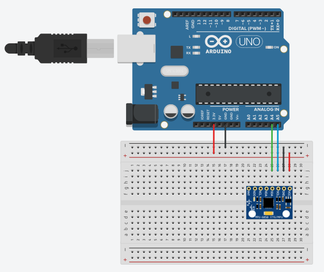

# Simple-MPU6050-Arduino
This is a simple Arduino library for using the MPU6050 accelerometer &amp; gyroscope sensor from invensense. It allows to easily read the acceleration, gyroscope (angular speed) and temperature measurements directly as a float value in physical units.

## Features

This library is meant as a starting base when using the MPU6050 sensor. It is meant to be simple and easy to use, as part of an arduino project. In particular, the library does not implement or make use of all the features of the chip (such as the FIFO buffer, Digital Motion Processor), and the code is not optimized for any board. 

The Mpu6050 class represents a sensor (more than one sensor can be used) and can be used to configure it and read measurements.
The technical aspects of understanding how to use the chip are hidden behind a simple interface: the user can read the measurements in real-world units without having to go through all the database to find how to convert a raw 16-bit integer to °/s, etc...

The Mpu6050Data represents the data measured by the sensor: acceleration (Vector3f), gyroscope (Vector3f), temperature (float)

A Vector3f class is used by the two previous classes; it is a simple class to represent a 3D vector with 3 float components. It has some useful methods such as magnitude and dot product, and some operator have been overloaded (+,-,/,...) to make vector computations easier to read. 

Here's a list of some of the supported features:
- Read measurements in physical units (gyro:°/s, accel:m/s^2, temp:°C)
- Gyroscope and accelerometer configuration (selecting the range of measurements)
- Digital Low Pass Filter (DLPF) configuration
- Multiple sensors (up to 2 sensors on the same I2C bus, support of multiple I2C buses)
- Enter and Exit sleep mode (power saving mode)

Here's a list of some features NOT supported (on purpose):
- Interrupts
- FIFO buffer
- Digital Motion Processor (DMP)

## Getting Started

You will first need to install the Arduino IDE if you haven't already, and of course you will need a MPU6050 (for example, the GY-521 board that is a minimal board for this sensor can be bought for 2-3$).

### Installing

Copy the [Simple-MPU6050-Arduino](https://github.com/Th-Havy/Simple-MPU6050-Arduino) folder to your Arduino libraries folder (located where you installed the Arduino IDE, for ex: C:\Program Files (x86)\Arduino\libraries).

### Schematic

Connect the GY-521 board (or any equivalent MPU6050 powered board) to your Arduino board as follows:

| Arduino | MPU6050 board |
| ------- | ------------- |
|   3.3V  |      Vcc      |
|   GND   |      GND      |
|   SCL   |      A5       |
|   SDA   |      A4       |
  
Note that the MPU6050 chip itself is not 5V tolerant, but some board like the GY-521 include a voltage converter to be able to connect it to 5V. If you don't know which voltage to choose it's safer to use 3.3V in order not to destroy the sensor.

### Running an example

Restart the arduino IDE and select an example: File > Examples > Simple-MPU6050-Arduino.

## Authors

* **Thomas Havy**

## License

This project is licensed under the MIT License - see the [LICENSE](LICENSE) file for details

## Acknowledgments

* The invensense datasheet for the MPU6050 is useful if you wish to understand the implementation of the methods. Here is the [Datasheet](https://www.invensense.com/wp-content/uploads/2015/02/MPU-6000-Datasheet1.pdf) and even more importantly the [Register Map](https://www.invensense.com/wp-content/uploads/2015/02/MPU-6000-Register-Map1.pdf).
* If you want a more in-depth use of the MPU6050 you can use Jeff Rowberg's [library](https://github.com/jrowberg/i2cdevlib/tree/master/Arduino/MPU6050) which is much more advanced.
